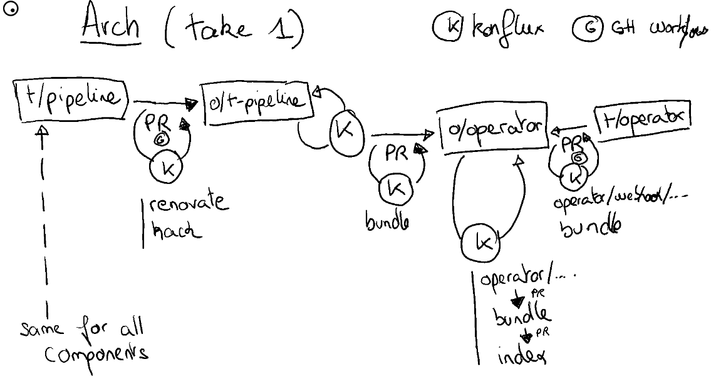
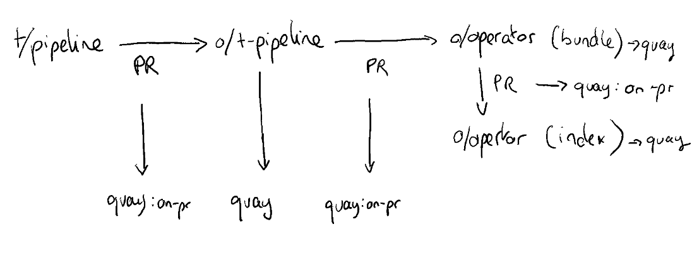

# openshift-pipelines operator repository

This is the *future* source of truth for building the OpenShift Pipelines operator with [Red Hat Konflux CI](https://github.com/konflux-ci/) instance.
This repository vendors [`tektoncd/operator`][tektoncd-operator] and gets image references from other "vendored" project from [openshift-pipelines][osp].

The list of projects that "contribute" to this are:
- [`openshift-pipelines/tektoncd-pipeline`][osp-tektoncd-pipeline] (upstream: [`tektoncd/pipeline`][tektoncd-pipeline]
- [`openshift-pipelines/tektoncd-triggers`][osp-tektoncd-triggers] (upstream: [`tektoncd/triggers`][tektoncd-triggers]
- [`openshift-pipelines/tektoncd-chains`][osp-tektoncd-chains] (upstream: [`tektoncd/chains`][tektoncd-chains]
- [`openshift-pipelines/tektoncd-results`][osp-tektoncd-results] (upstream: [`tektoncd/results`][tektoncd-results]
- [`openshift-pipelines/tektoncd-cli`][osp-tektoncd-cli] (upstream: [`tektoncd/cli`][tektoncd-cli]
- [`openshift-pipelines/tektoncd-hub`][osp-tektoncd-hub] (upstream: [`tektoncd/hub`][tektoncd-hub]
- [`openshift-pipelines/manual-approval-gate`][osp-mag]
- [`openshift-pipelines/pipelines-as-code`][osp-pac]
- [`openshift-pipelines/tekton-caches`][osp-tekton-caches]
- [`openshift-pipelines/opc`][osp-opc]

In addition, some of the configuration of this repository are generated from the [`hack` project][osp-hack].

## Structure

- [`project.yaml`](./project.yaml) holds the source of truth of most things that are generated.
  It stores all the component's built images (not released yet) as well as version numbers, …
- [`head`](./head) holds the commit SHA from [`tektoncd/operator`][tektoncd-operator] that is currently vendored.
- [`upstream`](./upstream) holds the *unchanged* vendored code from [`tektoncd/operator`][tektoncd-operator]
- [`openshift`](./openshift) holds openshift/openshift-pipelines specific code such as
  - [`dockerfiles`](./openshift/dockerfiles) for the operator's images.
  - [`bundle`](./openshift/olm-catalog/bundle) for the bundle image. 
    A lot of files in this repository are generated from the upstream code and some [`hack`](./hack) scripts.
  - [`index`](./openshift/olm-catalog/index) for the index image.
  - [`rpms`](./openshift/rpms) for the "prefetch" of rpms (as we build everything in an hermetic way)
- [`.github`](./.github) holds GitHub workflow configurations. Some of them are automatically generated by the [`hack` project][osp-hack].
- [`.konflux`](./.konflux) and [`.tekton`](./tekton) hold konflux and tekton manifests, and are mostly coming from the [`hack` project][osp-hack].

## Flow of *things*

TBD

## What "needs to happen" here

- We need to be able to re-build everything from scratch
  - the operator
  - the operands, such as pipeline, …
- We need to be able to push them, generate the bundle and then the image index
- We need to have this all happen in konflux…
  - … that doesn't support `ko` today
- We need to track upstream release and map to it ours.
- We need to track release branches as well

[tektoncd-pipeline]: https://github.com/tektoncd/pipeline
[tektoncd-operator]: https://github.com/tektoncd/operator
[tektoncd-triggers]: https://github.com/tektoncd/triggers
[tektoncd-chains]: https://github.com/tektoncd/chains
[tektoncd-results]: https://github.com/tektoncd/results
[tektoncd-cli]: https://github.com/tektoncd/cli
[tektoncd-hub]: https://github.com/tektoncd/hub
[osp]: https://github.com/openshift-pipelines
[osp-hack]: https://github.com/openshift-pipelines/hack
[osp-tektoncd-pipeline]: https://github.com/openshift-pipelines/tektoncd-pipeline
[osp-tektoncd-triggers]: https://github.com/openshift-pipelines/tektoncd-triggers
[osp-tektoncd-chains]: https://github.com/openshift-pipelines/tektoncd-chains
[osp-tektoncd-results]: https://github.com/openshift-pipelines/tektoncd-results
[osp-tektoncd-cli]: https://github.com/openshift-pipelines/tektoncd-cli
[osp-tektoncd-hub]: https://github.com/openshift-pipelines/tektoncd-hub
[osp-mag]: https://github.com/openshift-pipelines/manual-approval-gate
[osp-pac]: https://github.com/openshift-pipelines/pipelines-as-code
[osp-tekton-caches]: https://github.com/openshift-pipelines/tekton-caches
[osp-opc]: https://github.com/openshift-pipelines/opc
